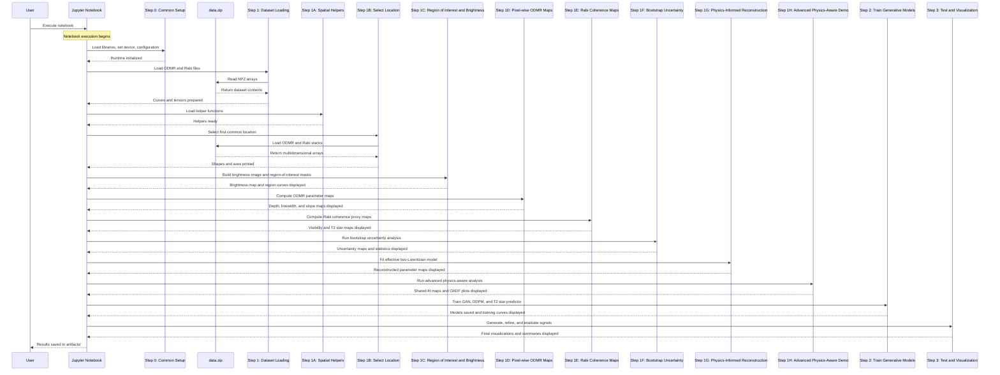

# GD-ODMR Spatial Demo Advanced

An end-to-end Jupyter Notebook workflow for **Optically Detected Magnetic Resonance (ODMR)** and **Rabi** spatial data analysis, uncertainty estimation, physics-informed reconstruction, and learning-based signal modeling.

This notebook is designed for paired ODMR and Rabi measurements stored in `data.zip`. It loads location-matched datasets, builds region-of-interest summaries, computes pixel-wise parameter maps, estimates uncertainty with bootstrap resampling, performs physics-informed fitting, and optionally trains deep learning models for signal generation, refinement, and parameter prediction.

---

## 1. Overview

The program integrates four analysis layers in one notebook:

1. **Data ingestion and pairing** of ODMR and Rabi measurements.
2. **Spatial analysis** using brightness images, region-of-interest masks, and per-pixel maps.
3. **Physics-aware interpretation** using Lorentzian fitting and reconstructed parameter maps.
4. **Learning-based modeling** using a **Generative Adversarial Network (GAN)**, **Denoising Diffusion Probabilistic Model (DDPM)**, and a **T2 star (T2\*) predictor**.

The workflow is especially useful when ODMR and Rabi measurements come from the same sample location but may differ in spatial grid size, orientation, or sampling density.

---

## 2. Main Features

- Loads paired ODMR and Rabi `.npz` files from `data.zip`
- Matches files by common location identifier
- Builds brightness-based **on-cell** and **off-cell** region-of-interest masks
- Automatically aligns masks and maps across different spatial resolutions
- Computes pixel-wise ODMR and Rabi summary maps
- Estimates uncertainty using photon-count bootstrap resampling
- Fits an effective two-Lorentzian model for physics-informed reconstruction
- Runs an advanced physics-aware demo with shared fitting and simulated **Optically Activated Delayed Fluorescence (OADF)** analysis
- Trains three optional machine learning models:
  - **Generative Adversarial Network (GAN)**
  - **Denoising Diffusion Probabilistic Model (DDPM)**
  - **T2 star (T2\*) predictor**
- Saves figures, maps, model files, and summary outputs under `artifacts/`

---

## 3. Repository-Style Input Structure

Expected input is a zip archive similar to:

```text
data.zip
├── fig_5/
│   ├── fig_5b/
│   │   ├── ... ODMR *.npz files
│   └── fig_5c/
│       ├── ... Rabi *.npz files
```

Each location should have ODMR and Rabi files that can be matched by a shared location identifier.

---

## 4. Execution Sequence

The notebook is organized as **steps**, not blocks. The sequence below follows the actual processing flow.



The sequence diagram above is based on the uploaded workflow description. fileciteturn1file0L1-L43

---

## 5. Step-by-Step Description

### Step 0. Common setup

This step imports Python libraries, defines configuration values, selects the execution device, initializes reproducibility settings, and prepares the output directory.

Typical tasks:

- import `numpy`, `torch`, `matplotlib`, and helper modules
- define runtime configuration
- set random seed
- create the `artifacts/` output folder

---

### Step 1. Dataset loading from `data.zip`

This step scans the zip archive, identifies valid ODMR and Rabi files, and pairs them using a common location identifier. It also extracts sweep axes such as frequency and time when available.

Outputs of this step usually include:

- paired file lists
- normalized curves
- tensor-ready arrays for later model training

---

### Step 1A. Spatial helper functions

This step defines helper functions used by the spatial demo. These functions support:

- reading arrays from `.npz`
- selecting a common location
- building region-of-interest masks
- aligning masks to a target shape
- resizing numeric maps when ODMR and Rabi grids differ
- saving figures and summary JSON files

This step is critical for robust execution when one modality has shape `(10, 10)` and the other has shape `(31, 31)`.

---

### Step 1B. Select a location and load spatial stacks

A single location that exists in both ODMR and Rabi data is selected. The corresponding multidimensional arrays are then loaded.

Typical array interpretation:

- ODMR stack: spatial dimensions plus frequency sweep
- Rabi stack: spatial dimensions plus time sweep

This step prints:

- array shapes
- location identifier
- axis ranges for frequency and readout time

---

### Step 1C. Brightness image and region-of-interest extraction

A brightness image is built from the ODMR data. Based on brightness statistics, the notebook defines an **on-cell** region-of-interest and an **off-cell** region-of-interest.

The brightness image is displayed together with the region masks, and averaged ODMR and Rabi curves are extracted from the selected regions.

#### Region-of-interest selection concept

A simple threshold-based region-of-interest can be written as:

```text
ROI_on(x, y) = 1, if B(x, y) >= P_q(B)
ROI_on(x, y) = 0, otherwise
```

where:

```text
B(x, y)   : brightness image
P_q(B)    : q-th percentile of brightness
```

The off-cell region-of-interest is typically selected from lower-intensity pixels, often with additional size constraints.

---

### Step 1D. Pixel-wise ODMR maps

This step computes per-pixel ODMR summary values such as dip depth, linewidth, and maximum slope.

#### ODMR contrast and dip depth

A simple normalized contrast form is:

```text
C(f) = 1 - I(f) / I_ref
```

where:

```text
I(f)      : measured fluorescence at frequency f
I_ref     : reference fluorescence level
```

A practical dip-depth estimate can be written as:

```text
depth = max_f C(f) - min_f C(f)
```

#### Local slope magnitude

A discrete slope estimate is:

```text
slope_max = max_i | C(f_{i+1}) - C(f_i) | / (f_{i+1} - f_i)
```

These maps show where resonance signatures are strong, broad, narrow, or sharply varying across the sample.

---

### Step 1E. Rabi coherence proxy maps

This step computes pixel-wise maps from the Rabi time-domain signal.

Typical outputs include:

- visibility map
- decay proxy map
- T2 star (T2\*) proxy map

#### Rabi visibility

A simple visibility proxy is:

```text
V(x, y) = (S_max(x, y) - S_min(x, y)) / (S_max(x, y) + S_min(x, y) + eps)
```

where:

```text
S_max, S_min : maximum and minimum signal over readout time
```

#### T2 star (T2\*) proxy

If the envelope is modeled approximately as exponential decay:

```text
S(t) ≈ A * cos(2π f_R t + phi) * exp(-t / T2*) + b
```

then `T2*` describes the effective dephasing time constant.

---

### Step 1F. Photon bootstrap uncertainty analysis

This step estimates confidence using photon-count resampling. For each pixel, synthetic photon measurements are sampled repeatedly, and the ODMR depth is recomputed.

#### Poisson resampling model

Photon counts are commonly modeled as:

```text
N' ~ Poisson(N)
```

where:

```text
N   : observed photon count
N'  : resampled photon count
```

If `depth^(b)` is the depth from bootstrap sample `b`, then:

```text
mu_depth = mean_b depth^(b)
sigma_depth = std_b depth^(b)
CI_width = Q_97.5(depth^(b)) - Q_2.5(depth^(b))
```

This step produces uncertainty maps and confidence summaries.

---

### Step 1G. Physics-informed reconstruction

This step fits an effective local resonance model to each pixel, usually using a two-Lorentzian line shape.

#### Two-Lorentzian model

A common form is:

```text
L(f) = c - a1 / (1 + ((f - f1) / gamma1)^2) - a2 / (1 + ((f - f2) / gamma2)^2)
```

where:

```text
c          : baseline level
a1, a2     : dip amplitudes
f1, f2     : resonance centers
gamma1, gamma2 : linewidth parameters
```

From this fit, the notebook can derive reconstructed maps such as:

```text
D_eff = (f1 + f2) / 2
E_eff = |f2 - f1| / 2
```

These maps are useful for interpreting spatially varying resonance behavior in a physics-aware way.

---

### Step 1H. Advanced physics-aware demo

This step extends the basic reconstruction with additional model logic such as:

- shared-parameter fitting
- powder-like ensemble effects
- combined ODMR and Rabi map usage
- simulated OADF timing analysis

#### OADF proxy formulation

A representative contrast-style proxy can be written as:

```text
C_OADF(x, y, t_r) = kappa * depth(x, y) * temporal(t_r) * coherence(x, y, t_r)
```

with example components such as:

```text
temporal(t_r) = (1 - exp(-t_r / tau_df)) * exp(-t_r / (2.5 * tau_df))
coherence(x, y, t_r) = exp(-t_r / max(2 * T2*(x, y), 1.0))
```

where:

```text
t_r      : readout time
tau_df   : delayed-fluorescence time constant
kappa    : scale factor
```

This advanced step is especially sensitive to shape alignment. If ODMR maps are `(10, 10)` and Rabi maps are `(31, 31)`, the notebook first resizes or aligns maps before combining them.

---

### Step 2. Train machine learning models

This step trains three optional models.

#### Step 2.1. Generative Adversarial Network (GAN)

The **Generative Adversarial Network (GAN)** learns to generate realistic Rabi-like signals conditioned on input context.

Standard objective:

```text
min_G max_D E_x[log D(x)] + E_z[log(1 - D(G(z)))]
```

where:

```text
G   : generator
D   : discriminator
z   : latent noise variable
x   : real data sample
```

#### Step 2.2. Denoising Diffusion Probabilistic Model (DDPM)

The **Denoising Diffusion Probabilistic Model (DDPM)** refines or denoises signals through iterative reverse diffusion.

A common training target is:

```text
L_DDPM = E_{x0, eps, t} [ || eps - eps_theta(x_t, t) ||^2 ]
```

where:

```text
x0        : clean data
eps       : Gaussian noise
x_t       : noisy sample at diffusion step t
eps_theta : learned noise predictor
```

#### Step 2.3. T2 star (T2\*) predictor

The **T2 star (T2\*) predictor** estimates dephasing-related quantities from signal features.

A simple supervised regression loss is:

```text
L_T2* = mean( (y_pred - y_true)^2 )
```

where:

```text
y_true : target T2* value
y_pred : predicted T2* value
```

Model files and training curves are typically saved under `artifacts/`.

---

### Step 3. Test and visualization

This final step evaluates the trained models and displays comparison plots.

Typical actions:

- generate a synthetic Rabi signal with the GAN
- refine it with the DDPM
- predict T2\* with the regression model
- compare real versus generated versus refined traces
- save final figures and summaries

---

## 6. Output Structure

Typical outputs are written under a run-specific directory, for example:

```text
artifacts/
└── run_YYYYMMDD_HHMMSS/
    ├── spatial_demo/
    │   ├── brightness and region-of-interest overlays
    │   ├── ODMR maps
    │   ├── Rabi maps
    │   ├── uncertainty maps
    │   ├── reconstruction maps
    │   └── advanced demo outputs
    ├── models/
    │   ├── GAN checkpoints
    │   ├── DDPM checkpoints
    │   └── T2 star predictor weights
    └── summaries/
```

---

## 7. Practical Notes on Shape Alignment

The notebook includes alignment logic because ODMR and Rabi data may not share the same native grid.

Supported cases include:

- exact shape match
- transpose-only alignment
- nearest-neighbor resizing
- transpose plus resizing

This is necessary for steps that combine:

- region-of-interest masks from ODMR with Rabi arrays
- ODMR depth maps with Rabi T2 star (T2\*) maps
- photon maps with OADF proxy calculations

---

## 8. Troubleshooting

### Problem: region-of-interest mask shape mismatch

Example:

```text
on_mask shape (10, 10) does not match target spatial shape (31, 31)
```

Meaning:

- the region-of-interest mask was created from one modality
- the target array belongs to a different spatial grid

Fix:

- use the built-in region-of-interest alignment function
- rerun the notebook from the beginning after kernel restart

### Problem: missing variables such as `odmr_on_curve`

Meaning:

- a later step was executed before the earlier step that defines these variables

Fix:

- rerun from Step 1C onward, or rerun the entire notebook in order

### Problem: broadcast error between ODMR and Rabi maps

Example:

```text
operands could not be broadcast together with shapes (10,10) (31,31)
```

Meaning:

- a numeric map from ODMR was combined with a numeric map from Rabi without alignment

Fix:

- use the numeric map alignment helper before joint calculations

---

## 9. Limitations

- The advanced OADF analysis is a **physics-inspired proxy**, not a direct measurement pipeline, unless explicit delayed-fluorescence data are present.
- T2 star (T2\*) estimates may be proxy values rather than rigorous spectroscopic fits, depending on the dataset.
- Deep learning outputs depend strongly on dataset quality, normalization strategy, and pairing consistency.
- Shared-fit physics maps are only as reliable as the local line-shape assumptions.

---

## 10. Recommended Usage

For the most stable execution:

1. Restart the kernel.
2. Run all steps from top to bottom.
3. Confirm shapes printed in Step 1B.
4. Inspect the region-of-interest overlay in Step 1C.
5. Verify map sizes before running the advanced OADF step.

---

## 11. Citation-Ready Summary

This notebook provides a reproducible computational workflow for paired **Optically Detected Magnetic Resonance (ODMR)** and Rabi spatial datasets. It combines region-based averaging, pixel-wise mapping, uncertainty quantification, effective line-shape fitting, advanced physics-aware proxy simulation, and optional learning-based signal modeling in a single executable analysis environment.
